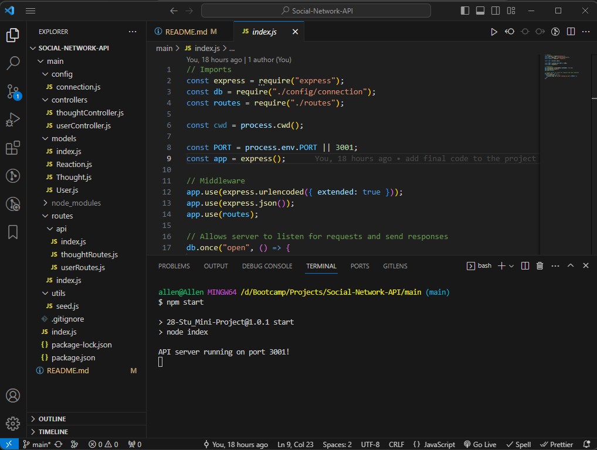

# Social-Network-API
The goal of this project is to build an API calls to allow a social network web application to manage their user's, thoughts, friends and reactions DB using API calls.
This project is just the backend API call to the social network application which means it doesn't contain a frontend page view.
This project utilizes Express.js for routing, MongoDB for a NoSQL database, and Mongoose Object Document Mapper for Node.js.

## GitHub Repo URL
https://github.com/AllenHirmiz/Tech-Blog-Website

## Website URL
GitHub Repo URL Only

## Table of Contents
N/A

## Installation
Start by forking this repository on Github.
Clone this project to your machine by using the "git clone + URL" command.
Open the project with your favorite text editor, like VS Code (in your terminal, first type "cd foldername" then "code .").
Install Node.js from their website, if you have not already. Here are some additional instructions.
Install MongoDB from their website, if you have not already. Here are some additional instructions.
Install Nodemon.
Install Insomnia.
This project includes a package.json file that specifies dependencies for this project, so be sure to run "npm install". This will install the packages specified in the next section.

## Technologies Used
This API project is built using the following technologies:

Javascript
Node.js
Git
Insomnia
MongoDB
nodemon
express
dotenv
mongoose

## Video
[Walkthrough video demonstrating the functionality of the application][def1]

[def1]: https://www.youtube.com/watch?v=1G9Slzi-fFQ

# Screenshots
## Vscode
To run the app using Insomnia, first we need to use npm i to install, then npm start to run the app.

## Insomnia API Calls
Using Insomnia to access API call for Users, Thoughts, Reactions and Friends.

